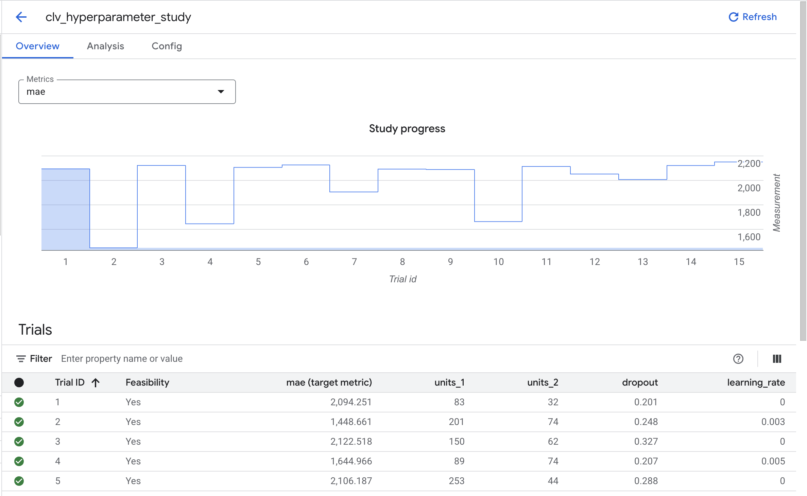
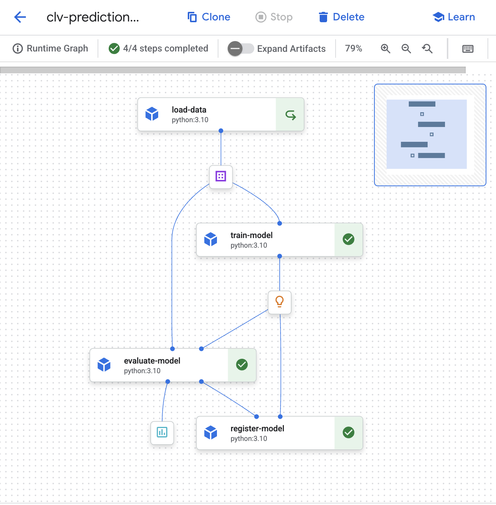
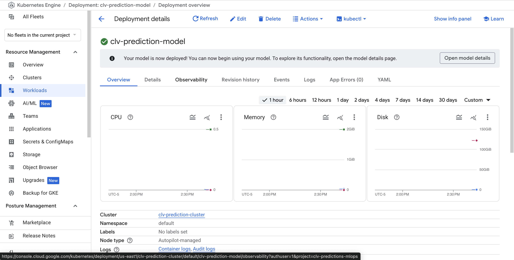
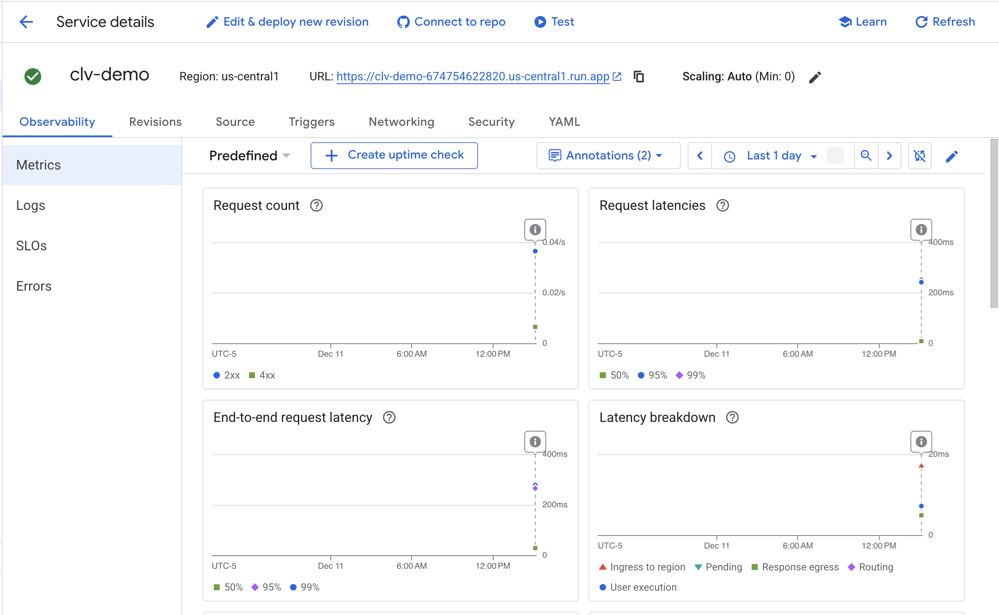
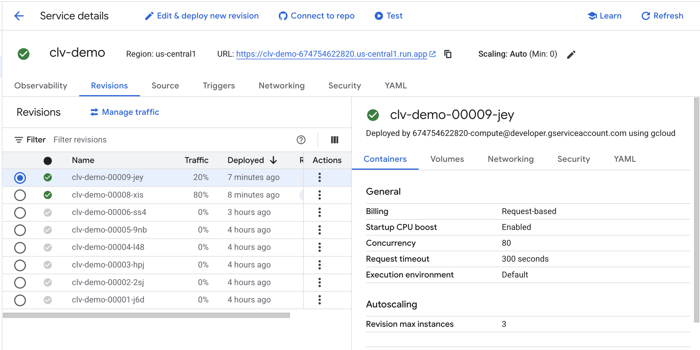
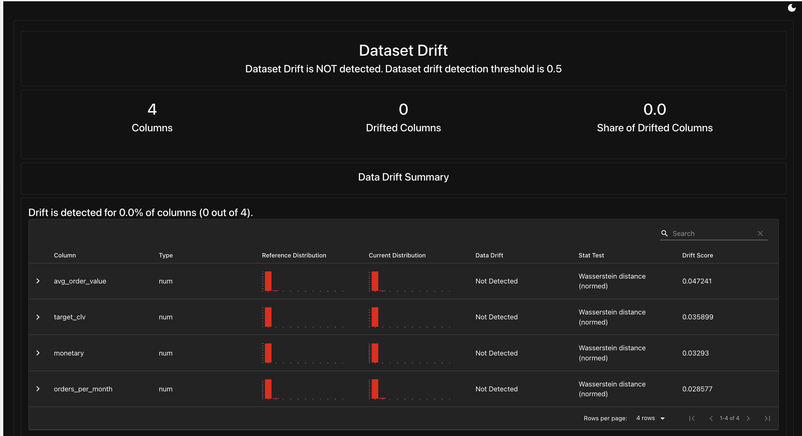
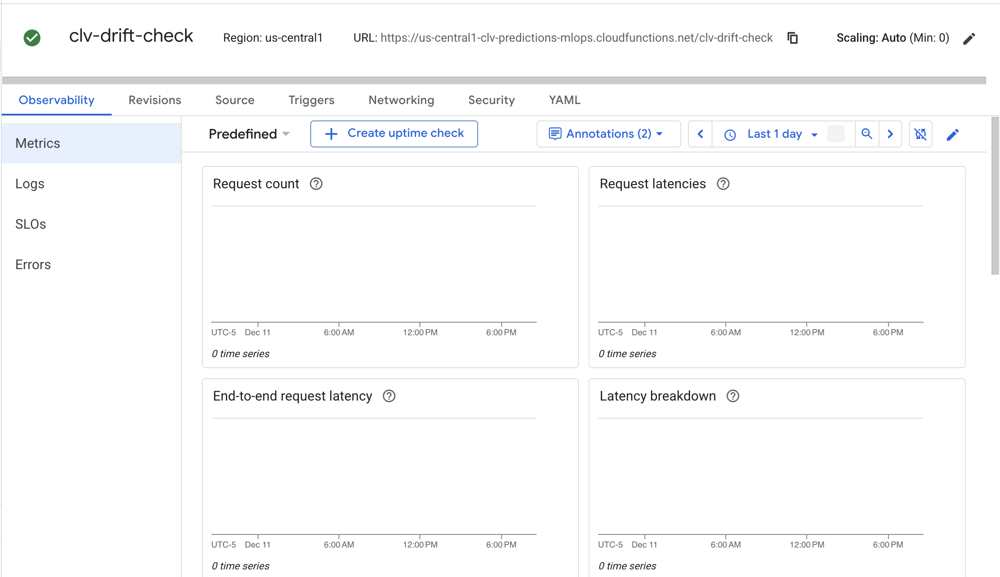
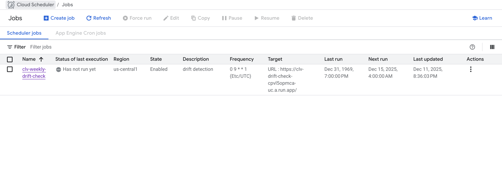
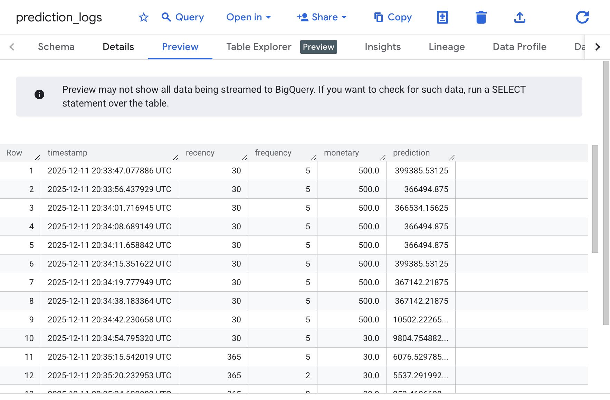

# Customer Lifetime Value Prediction

**[Live Demo](https://clv-demo-674754622820.us-central1.run.app/)** | Production MLOps pipeline predicting 12-month customer lifetime value using a hybrid neural network with Hugging Face embeddings

---

## Problem

E-commerce companies allocate marketing spend inefficiently without accurate predictions of which customers will generate long-term revenue.

## Solution

Built a hybrid deep neural network combining RFM behavioral features with Hugging Face text embeddings from product descriptions, predicting 12-month CLV with automated drift detection and retraining triggers.

## Results

| Metric | Value |
|--------|-------|
| R² Score | 0.735 |
| Median Absolute Error | $429 |
| Predictions within $1,000 | 68.6% |
| Tuning Improvement | 27% MAE reduction |

---

## Architecture
```
                           CLV PREDICTION MLOPS PIPELINE

==============================================================================
                                 DATA LAYER
==============================================================================

  +-----------+     +-----------+     +-----------+     +-----------+
  |  BigQuery |---->|  Dataproc |---->|  Hugging  |---->|    GCS    |
  | (Raw Data)|     | (PySpark) |     |   Face    |     |(Features) |
  +-----------+     +-----------+     +-----------+     +-----+-----+
                                                              |
                                                              v
==============================================================================
                                  ML LAYER
==============================================================================

  +-----------+     +-----------+     +-----------+     +-----------+
  |  Vertex   |---->|  Vertex   |---->|   Model   |---->|    GKE    |
  |  Vizier   |     | Pipeline  |     | Registry  |     |  (Prod)   |
  +-----------+     +-----+-----+     +-----+-----+     +-----------+
                          |                 |
                          |                 |           +-----------+
                          |                 +---------->| Cloud Run |
                          |                             |(Demo+A/B) |
                          |                             +-----+-----+
                          |                                   |
                          | Retrain                           |
                          |                                   v
==============================================================================
                             MONITORING LAYER
==============================================================================

  +-----------+     +-----------+     +-----------+     +-----------+
  |   Cloud   |---->| Evidently |---->|   Cloud   |<----|  BigQuery |
  | Scheduler |     |  (Drift)  |     | Function  |     |  (Logs)   |
  +-----------+     +-----------+     +-----+-----+     +-----------+
                                            |
                                            v
                                      +-----------+
                                      |  Vertex   |
                                      | Pipeline  |
                                      +-----------+
```

---

## Pipeline Screenshots

### Vertex AI Vizier Hyperparameter Tuning


### Vertex AI Pipeline Orchestration


### GKE Production Deployment


### Cloud Run Demo with A/B Testing



### Evidently AI Drift Monitoring


### Cloud Scheduler + Cloud Functions Retraining



### BigQuery Prediction Logging


---

## Tech Stack

| Category | Technologies |
|----------|-------------|
| **Modeling** | TensorFlow, Hybrid NN, Hugging Face Embeddings, Integrated Gradients |
| **Data Processing** | PySpark, Dataproc, BigQuery |
| **Orchestration** | Vertex AI Pipelines, Vertex AI Vizier |
| **Deployment** | GKE, Cloud Run, A/B Traffic Splitting |
| **Monitoring** | Evidently AI, BigQuery Logging, Cloud Scheduler |
| **Automation** | Cloud Functions, Cloud Build CI/CD |

---

## Project Structure
```
clv-prediction-mlops/
├── notebooks/
│   ├── 01-data-preparation.ipynb      # BigQuery → PySpark → Hugging Face
│   ├── 02-nn-training.ipynb           # Baseline hybrid NN
│   ├── 03-hyperparameter-tuning.ipynb # Vizier optimization
│   ├── 04-pipeline-orchestration.ipynb # Vertex AI Pipeline
│   └── 05-monitoring-deployment.ipynb  # GKE, Cloud Run, Evidently
├── cloud_functions/
│   ├── retrain_trigger/               # Triggers pipeline retraining
│   └── drift_check/                   # Runs Evidently drift detection
├── streamlit_app/
│   ├── app.py                         # Demo application
│   ├── Dockerfile
│   └── requirements.txt
├── screenshots/
├── cloudbuild.yaml                    # CI/CD configuration
└── README.md
```

---

## Dataset

**UCI Online Retail II** - Real transactional data from a UK online retailer (2009-2011).

| Attribute | Value |
|-----------|-------|
| Customers | 4,266 |
| Features | 396 (12 numerical + 384 embeddings) |
| Target | 12-month CLV |

**Feature Engineering:**
- RFM metrics (recency, frequency, monetary)
- Behavioral features (tenure, unique products, orders per month)
- Hugging Face `all-MiniLM-L6-v2` embeddings from product descriptions

---

## The Journey

**What worked:**
- Hugging Face embeddings captured product preference patterns that RFM alone missed
- Vertex AI Vizier found hyperparameters that reduced MAE by 27%
- Median AE ($429) tells a better story than MAE ($1,449) due to high-CLV outliers

**What I learned:**
- Neural networks for CLV are sensitive to outliers - robust metrics matter
- PySpark on Dataproc is overkill for 4K customers but demonstrates the pattern for scale
- Demo apps need realistic baselines - exposing 6 of 396 features required median imputation for the rest

**Production considerations:**
- Pipeline MAE threshold ($2,000) was exceeded due to NN randomness; production would compare against current champion model
- Cloud Scheduler deleted after screenshot to avoid costs; in production would run weekly
- GKE cluster deleted after deployment proof; Cloud Run sufficient for demo traffic

---

## Author

**Arion Farhi** - [LinkedIn](https://www.linkedin.com/in/arionfarhi/) | [GitHub](https://github.com/arion-farhi)
